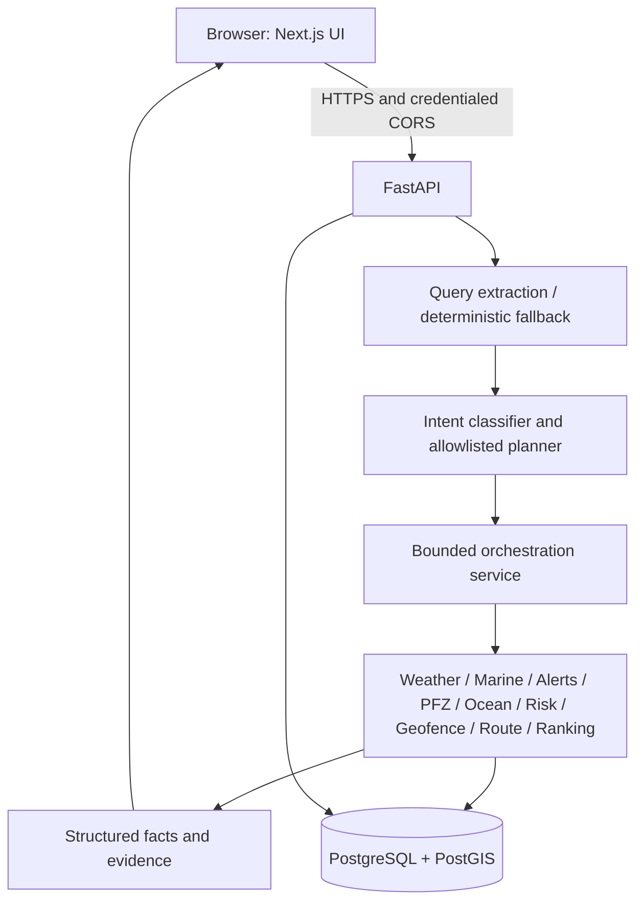

# Actual ORCA architecture

Risk and geospatial/route constraints are deterministic. LLM is optional language
extraction/formatting infrastructure. Current chat uses the bounded orchestrator
directly; a LangGraph builder exists but is not its persisted execution runtime.
SQL conversations/messages are saved; cross-turn reference context, Postgres graph
checkpoints and SSE are not implemented. The UI reports completed activity after
an atomic response. It does not simulate live agent progress.

Repository: `src/app` pages, `src/components` UI/map, `src/features` typed state;
`apps/api/app` API/services/providers/deterministic engines; `apps/api/alembic`
frozen migrations; `apps/api/tests` unit/spatial tests; `tests/e2e` browser smoke;
`apps/api/scripts` seed/smoke commands; `.github/workflows/ci.yml`; root Docker,
Compose, Makefile and Railway config; `docs` release/demo evidence.

The intended broader product statement is partially demonstrated: ORCA selects
specialized services for a marine query and returns deterministic facts and
source evidence. Seamless contextual multi-turn, live validated route recommendations
and full map-action orchestration remain partial; do not present the target diagram
as proof those paths execute today.
